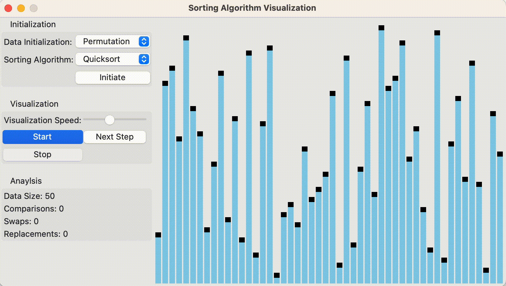

# Sorting Algorithm Visualization

Watch your favorite sorting algorithms do what they do best!

    
  

  

  Visualization of Quicksort

## About
A simple application for the visualization and analysis of various sorting algorithms. Written in python and using the Tkinter library.

## Features
1. Initialization of various arrangements of unsorted data, for example permuted, partially permuted or reverse-ordered data.

2. Visualization of the process of sorting the initialized data by various sorting algorithms. Available algorithms are **Selectionsort**, **Heapsort**,  **Insertionsort**, **Shellsort**, **Bubblesort**, **Shakersort**, **Combsort**, three variants of **Quicksort**, three variants of **Mergesort** and two variants of **Radixsort**.

3. Simple extensibility of other sorting algorithms. Simply implement your sorting algorithm using the `Sorter` class.

## Run
To run this application execute `main.py`. The only dependency is `numpy`.

## Some Visualizations

<a href="images/natural-mergesort-permutation.gif>Visualization of Natural Mergesort</a>

<a href="images/heapsort-sorted.gif>Visualization of Heapsort</a>

<a href="images/insertionsort-local.gif>Visualization of Natural Insertionsort</a>

<a href="images/median-quicksort-permutation.gif>Visualization of Median Quicksort</a>

## References

T. Ottmann and P. Widmayer. *Algorithmen und Datenstrukturen*. Spektrum Akad. Verl., 1996
