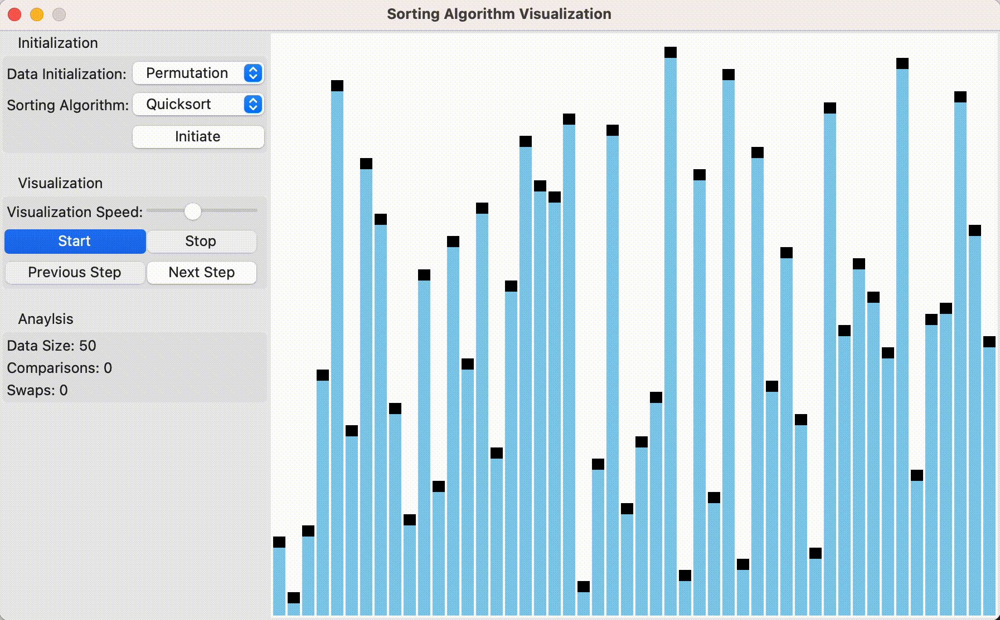

# Sorting Algorithm Visualization

Watch your favorite sorting algorithms do what they do best!

  

## About
A simple application for the visualization and analysis of various sorting algorithms. Written in python and using the Tkinter library.

## Features
1. Initiation of various kinds of unsorted data, for example fully permutated data, locally permutated data or reverse-ordered data.

2. Visualization of various sorting algorithms. Available algorithms are Selection sort, Bubblesort and Quicksort.

3. Simple extensibility of other sorting algorithms. Simply implement your sorting algorithm using the `Sorter` class.

## Run
To run this application execute `main.py`. The only dependency is `numpy`.
